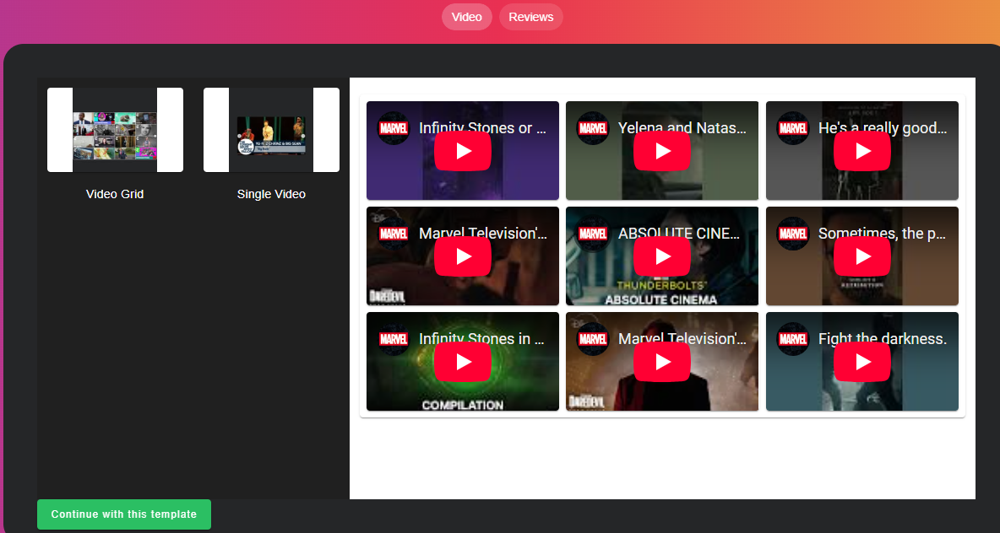
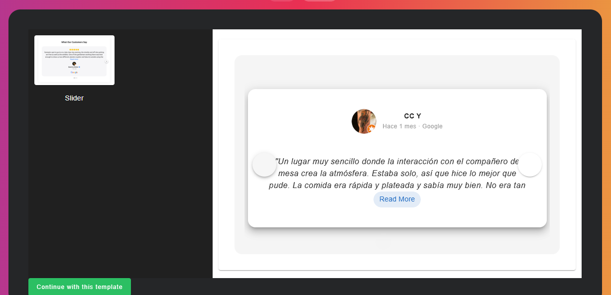

# Consumo de API de Youtube y google 

[robzm.github.io/api-widget/](https://robzm.github.io/api-widget/)

Este proyecto consiste en una aplicación web desarrollada en Vue.js que consume una API de Youtube y Google. Utiliza Vuetify para los componentes de la interfaz de usuario, CSS personalizado y Tailwind para estilos adicionales.

## Screenshots



## Tecnologías Usadas

- **Vue.js**: Framework de JavaScript para construir la interfaz de usuario.
- **Vuetify**: Biblioteca de componentes de UI para Vue.
- **Tailwind CSS**: Framework de CSS utilitario para estilos personalizados.
- **Axios**: Librería para realizar peticiones HTTP a la API.
- **Pinia**: Gestión del estado de la aplicación.
- **Places API**: API utilizada para obtener reseñas de lugares.
- **YouTube Data API v3**: API utilizada para obtener videos, vistas, likes, etc de un canal de youtube.

## Estructura Basica del Proyecto

```plaintext
src/
├── assets/                 # Archivos estáticos (imágenes, fuentes, etc.)
├── components/             # Componentes de la interfaz de usuario (UI)
├── stores/                 # Manejo del estado con Pinia                 
└── services/               # Servicios para interactuar con las APIs
```
## Configuración de API Keys

Para consumir las APIs de Google, como **Google Places API** y **YouTube Data API**, necesitas obtener una **API Key** a través de la **Google Cloud Console**.

### Google Places API
1. Accede a [Google Cloud Console](https://console.cloud.google.com/).
2. Crea o selecciona un proyecto.
3. Habilita las **Google Places API** y **Google Maps JavaScript API** (si es necesario).
4. Ve a **Credenciales** y crea una **API Key**.
5. Guarda la **API Key** para usarla en las peticiones.

### YouTube Data API
1. Accede a [Google Developers Console](https://console.developers.google.com/).
2. Crea o selecciona un proyecto.
3. Habilita la **YouTube Data API v3** desde la **Biblioteca**.
4. Ve a **Credenciales** y crea una **API Key**.
5. Guarda la **API Key** para usarla en las peticiones.


## Uso de axios y pinia

En este proyecto, Axios se utiliza para hacer peticiones HTTP a las APIs de **Google Places** y **YouTube**, obteniendo reseñas de lugares y datos de videos, respectivamente.
Pinia se utiliza en este proyecto para manejar el estado de las reseñas obtenidas desde la API de **Google Places** y la información de videos de **YouTube**, asegurando que la información esté disponible en todos los componentes relevantes de la aplicación.

## Funcionalidades Principales

- **Visualización de reseñas de un lugar**: Se puede ver reseñas de un lugar a través de la **Places API**.
- **Reproducción de videos de YouTube**: Se pueden visualizar videos de un canal de YouTube, así como obtener estadísticas como vistas y likes utilizando la **YouTube Data API**.

